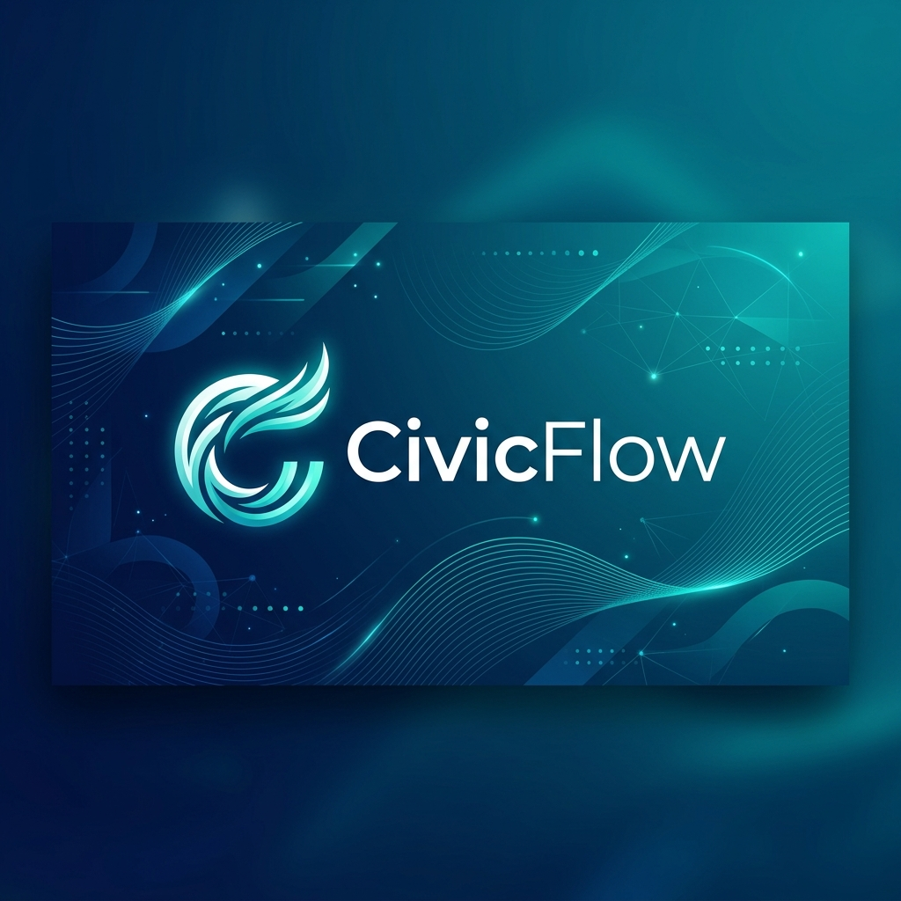

# <div align="center">CivicFlow: Your Personal Election Copilot</div>

<div align="center">
  
</div>

<div align="center">
  
  [](https://nextjs.org/)
  [](https://www.typescriptlang.org/)
  [](https://firebase.google.com/)
  [](https://tailwindcss.com/)
  [](https://opensource.org/licenses/MIT)

</div>

---

## 🌟 Overview

**CivicFlow** is an industrial-grade, interactive web platform designed to democratize and simplify the election process. Built for the modern voter, it transforms complex bureaucratic requirements into a seamless, personalized journey. Whether you're a first-time voter or a seasoned citizen, CivicFlow ensures you vote with confidence.

## ✨ Key Features

- 🗺️ **Smart Timeline & Risk Meter**: Dynamically generated voter roadmap based on your specific location and registration status.
- 📍 **Polling Station Finder**: Real-time integration with Google Maps to find the nearest voting centers with accessibility details.
- 🤖 **AI Election Copilot**: An intelligent assistant powered by **Google Gemini** to answer election-related queries in plain language.
- 📋 **Eligibility Checker**: Interactive document verification and status tracking to ensure you're "ready to vote."
- 🌍 **Multi-lingual Support**: Full internationalization supporting **English, Spanish, Hindi, and Marathi**.
- 🛠️ **Admin Control Center**: A secure dashboard for election officials to manage global rules and deadlines.

## 🚀 Tech Stack

- **Framework**: [Next.js 15](https://nextjs.org/) (App Router, Client/Server Components)
- **Styling**: [Tailwind CSS 4.0](https://tailwindcss.com/) with Glassmorphism effects
- **Animations**: [Framer Motion](https://www.framer.com/motion/) for fluid micro-interactions
- **Backend**: [Firebase](https://firebase.google.com/) (Auth, Firestore, Hosting, Cloud Functions)
- **AI Engine**: [Google Gemini Pro](https://deepmind.google/technologies/gemini/)
- **Maps**: [Google Maps Platform](https://developers.google.com/maps)
- **State Management**: React Context API with custom hooks

## 🛠️ Local Development

### Prerequisites

- Node.js 20+
- Firebase CLI (`npm install -g firebase-tools`)
- A Google Cloud Project for Gemini & Maps APIs

### Installation

1. **Clone the repository:**
   ```bash
   git clone https://github.com/your-username/civicflow.git
   cd civicflow
   ```

2. **Install dependencies:**
   ```bash
   npm install
   ```

3. **Configure Environment Variables:**
   Create a `.env.local` file in the root directory:
   ```env
   NEXT_PUBLIC_FIREBASE_API_KEY=your_key
   NEXT_PUBLIC_FIREBASE_AUTH_DOMAIN=your_domain
   NEXT_PUBLIC_FIREBASE_PROJECT_ID=your_id
   NEXT_PUBLIC_FIREBASE_STORAGE_BUCKET=your_bucket
   NEXT_PUBLIC_FIREBASE_MESSAGING_SENDER_ID=your_id
   NEXT_PUBLIC_FIREBASE_APP_ID=your_app_id
   NEXT_PUBLIC_GOOGLE_MAPS_API_KEY=your_maps_key
   GEMINI_API_KEY=your_gemini_key
   ```

4. **Run the development server:**
   ```bash
   npm run dev
   ```

## 🧪 Quality Assurance

We maintain high standards for code quality and reliability:

- **Unit Testing**: `npm run test:unit` (Powered by Vitest)
- **E2E Testing**: `npm run test:e2e` (Powered by Playwright)
- **Linting**: `npm run lint` (ESLint with Next.js rules)

## 📁 Project Structure

```text
src/
├── app/            # Next.js App Router (Pages & Layouts)
├── components/     # Reusable UI components (Atomic Design)
├── context/        # Global state providers (Auth, I18n)
├── lib/            # Shared utilities and configurations
├── services/       # External API integrations (Firebase, AI)
├── types/          # TypeScript interface definitions
└── utils/          # Helper functions and constants
```

## 🛡️ Security & Accessibility

- **RBAC**: Role-Based Access Control for administrative tasks.
- **WCAG 2.1**: Compliant with accessibility standards for inclusive voting.
- **Security**: Server-side validation via Firebase Cloud Functions.

---

## 🧠 Technical Deep Dive

### 🏗️ Architectural Patterns
- **Edge-Side Contextualization**: Uses Next.js Middleware to intercept requests at the edge, extracting geo-location headers (provided by Vercel/Cloudflare) to inject hyper-local metadata into the application context without client-side latency.
- **Service-Oriented Logic**: Decoupled infrastructure logic into a dedicated Service Layer (`src/services`), ensuring that the UI remains agnostic to the underlying data source and facilitating easier testing/mocking.
- **Singleton Provider Pattern**: Firebase and Auth initializations are managed via singleton patterns with strict environment validation to prevent client-side crashes during SSR/ISR.

### 🔐 Governance & Security
- **Declarative Security Rules**: Firestore implements a zero-trust model using declarative security rules. Permissions are governed by `isOwner()` and `isAdmin()` helper functions, with nested data validation (e.g., `isValidProfile()`) to prevent schema pollution.
- **Immutable Audit Trails**: Implements a server-side audit logging system that records critical user actions (profile updates, data mutations) along with metadata like `userAgent` and `timestamp` for compliance and security monitoring.
- **Strict Type Safety**: End-to-end type safety is enforced using **TypeScript 5.x** and **Zod** for runtime schema validation, ensuring that data fetched from external APIs adheres to expected shapes before hitting the application state.

### ⚡ Performance & Scalability
- **Hybrid Rendering Strategy**: Leverages Next.js 15 App Router for a mix of Static Site Generation (SSG) for informational pages and Dynamic Rendering for personalized dashboards.
- **Optimized Asset Pipeline**: Utilizes Next.js Image component and Tailwind 4's JIT compiler to minimize bundle sizes and maximize Core Web Vitals (LCP, CLS).
- **Global Distribution**: Deployed on a global CDN edge, with Firebase's serverless infrastructure handling horizontal scaling automatically.

### 🛠️ DevOps & Quality Assurance
- **Automated CI Pipeline**: Integrated GitHub Actions (`ci.yml`) for automated linting, type checking, and unit testing on every pull request.
- **Comprehensive Testing Suite**: 
    - **Unit/Integration**: Powered by **Vitest** and **React Testing Library** for component logic.
    - **E2E**: Orchestrated by **Playwright** to simulate user journeys across the dashboard and onboarding flows.
- **Environment Isolation**: Strictly segregated development and production environments using Firebase project aliasing and protected environment variables.

---

<div align="center">
  Built with ❤️ by the CivicFlow Team
</div>
